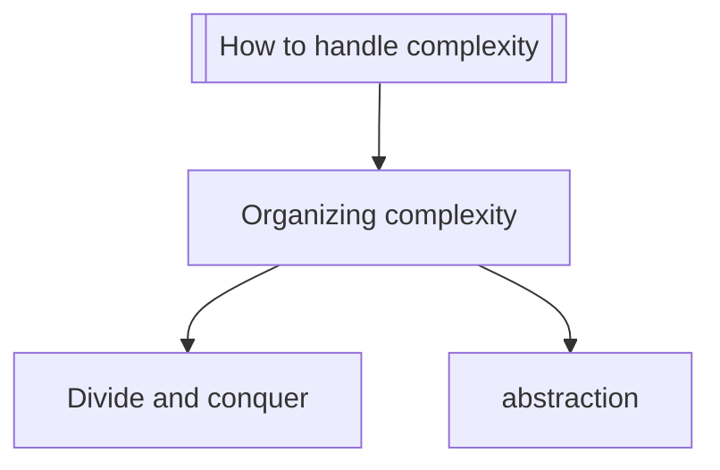

# G(enerator-in)ator

```
           .-._   _ _ _ _ _ _ _ _
.-''-.__.-'00  '-' ' ' ' ' ' ' ' '-.
'.___ '    .   .--_'-' '-' '-' _'-' '._
 V: V 'vv-'   '_   '.       .'  _..' '.'.
   '=.____.=_.--'   :_.__.__:_   '.   : :
           (((____.-'        '-.  /   : :
                             (((-'\ .' /
                           _____..'  .'
                          '-._____.-'
```

Gator is a static-site generator. It transforms a directory
of markdown files and HTML templates into a website.

```bash
cargo install
```

```bash
gator [--server]
```

# Features

- Templating
- Insert code snippets
- SCSS generation

Novel features:

- Uses pandoc to generate documents
- Syntax is compatible with out-of-the-box HTML/CSS linters, highlighters, and
  formatters
- Intuitive project structure
- Can convert Python `.ipynb` notebooks to HTML
- Latex equations are converted during generation — no client-side Javascript
  required

## Added markdown features

Mermaid diagrams can be created using standard code blocks:

````

````
