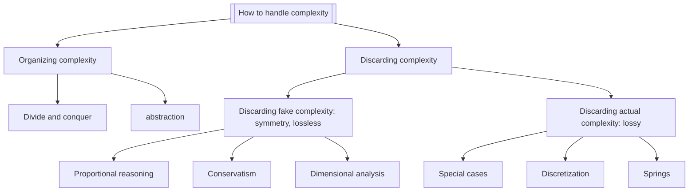

---
---
# Markdown Tests

## Basic markdown

### h3

#### h4

##### h5

###### h6

**Sed ut perspiciatis unde omnis** iste _natus error sit voluptatem accusantium
doloremque laudantium_, ~~totam rem aperiam~~, `eaque ipsa quae ab illo` et
quasi architecto beatae vitae dicta sunt explicabo.

Lorem ipsum dolor sit amet, consectetur adipiscing elit, sed do eiusmod tempor
incididunt ut labore et dolore magna aliqua.[^1] Ut enim ad minim veniam, quis
nostrud exercitation ullamco laboris nisi ut aliquip ex ea commodo
consequat.[^2] Duis aute irure dolor in reprehenderit in voluptate velit esse
cillum dolore eu fugiat nulla pariatur.[^3] Excepteur sint occaecat cupidatat
non proident, sunt in culpa qui officia deserunt mollit anim id est laborum.[^4]

[^1]: This is a footnote test
[^2]: Fun fact: I don't speak latin
[^3]:
    This is also a very, very long line that will cause the text to overflow and
    wrap onto the next line

[^4]: https://google.com

----

1. H~2~O
2. H~2~O~2

- [x] Write the press release
- [ ] Update the website
- [ ] Contact the media

Code block:

```golang
func main() {
 goto := 15

  fmt.Println("Goto:", goto)
}
```

Table:

| Name        | Age | Occupation  |
|-------------|-----|-------------|
| John Doe    | 34  | Programmer  |
| Jane Smith  | 28  | Designer    |
| Alice Jones | 42  | Manager     |

Nemo enim ipsam voluptatem quia voluptas sit aspernatur aut odit aut fugit, sed
quia consequuntur magni dolores eos qui ratione voluptatem sequi nesciunt.


## Gator-specific features

Rendering LaTeX to MathML

$$
G(x) = g_{0}x^0 + g_{1}x^1 + g_{2}x^2 + g_{3}x^3 + \dots =  \sum_{n=0}^{\infty} a_n x^n
$$

Math can also be done inline: $x + 10$

| Condition                                                                         |                                        Equivalence |
| --------------------------------------------------------------------------------- | -------------------------------------------------: |
| $f(n) = O(n^c)$ where $c < c_{crit}$                                              |                      $T(n) = \Theta(n^{c_{crit}})$ |
| $f(n) = \Theta(n^{c_{crit}} \cdot log^{k}{n})$ where $c = c_{crit}$ and $k \ge 0$ | $T(n) = \Theta(n^{c_{crit}} \cdot log^{k + 1}{n})$ |
| $f(n) = \Omega(n^c)$ where $c > c_{crit}$                                         |                               $T(n) = \Theta(n^c)$ |



**Sed ut perspiciatis unde omnis** iste _natus error [^5] sit voluptatem accusantium
doloremque laudantium_, ~~totam rem aperiam~~, `eaque ipsa quae ab illo` et
quasi architecto beatae vitae dicta sunt explicabo.

[^5]: >This is an example of a sidenote
